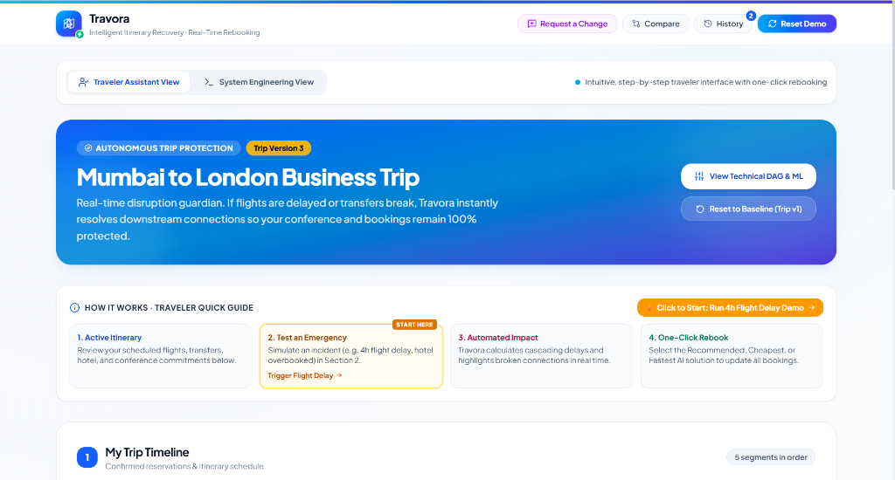
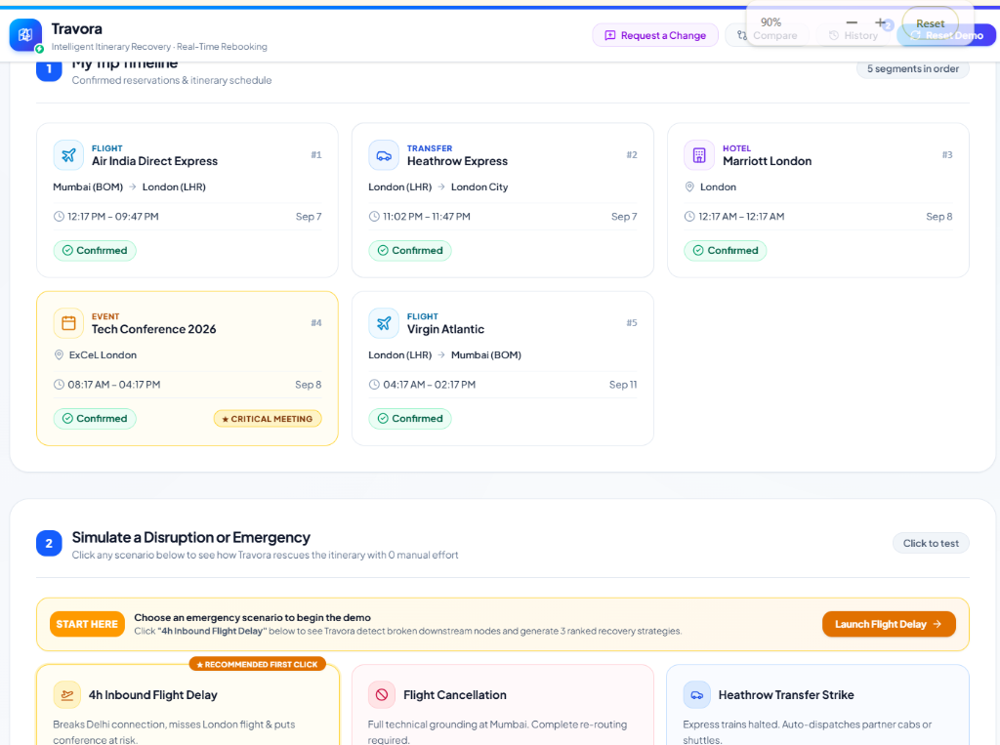
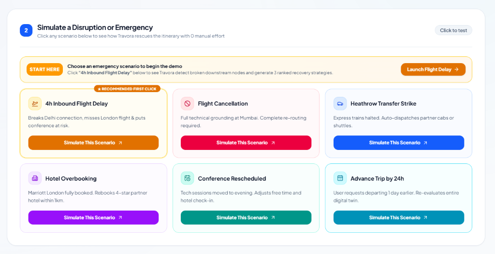
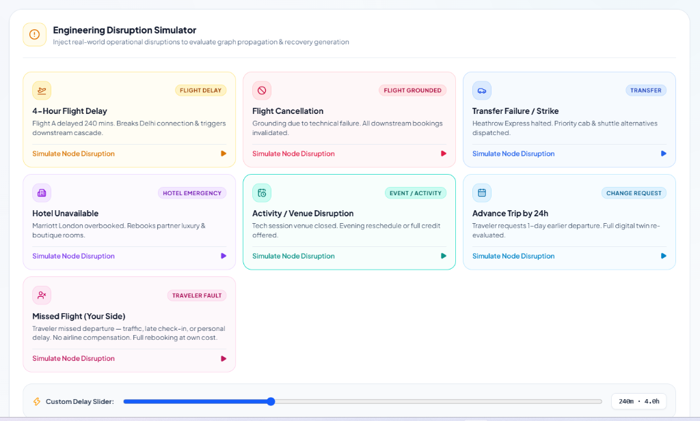
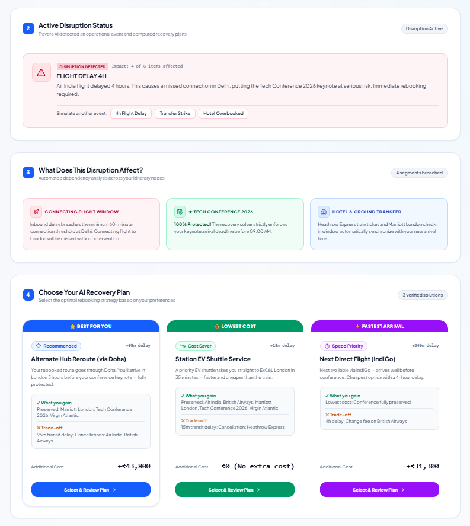

<div align="center">



# ✈️ Travora
### Intelligent Itinerary Recovery · Real-Time Rebooking

**Travora is an autonomous travel disruption management platform that detects flight delays, hotel overbookings, and missed connections in real time — then instantly generates ranked recovery plans so travelers never need to scramble.**

[](https://travora.vercel.app)
[](https://github.com/Harsh2059/Travora)
[](LICENSE)

</div>

---

## 📋 Table of Contents

1. [Problem Statement](#-problem-statement)
2. [Proposed Solution](#-proposed-solution)
3. [Key Features](#-key-features)
4. [System Architecture](#-system-architecture)
5. [Technology Stack](#-technology-stack)
6. [Implementation Details](#-implementation-details)
7. [Prototype Screenshots](#-prototype-screenshots)
8. [Getting Started](#-getting-started)
9. [API Reference](#-api-reference)
10. [Team](#-team)

---

## 🚨 Problem Statement

Modern business travel involves a chain of interdependent bookings — flights, transfers, hotels, and conference slots — where **a single disruption cascades into a broken itinerary**.

### The Reality Today

| Scenario | Current Experience |
|---|---|
| ✈️ Flight delayed 4 hours | Traveler manually calls airline, hotel, transfer |
| 🏨 Hotel overbooked | Traveler scrambles to find alternatives on 3 apps |
| 🚌 Transfer cancelled | Traveler misses a flight connection |
| 📅 Conference rescheduled | Traveler has no idea downstream items are now wrong |

### The Cost

- **Average 2.5 hours** lost per disruption managing rebooking across apps
- **30% of business travelers** miss at least one connecting segment per year due to cascading failures
- **No single platform** today models the downstream dependency graph of a traveler's entire itinerary
- Airlines, hotels, and transfer providers operate in **complete isolation** — no shared awareness of a traveler's full journey

### The Core Gap

> *When my Air India flight is delayed 4 hours, my Heathrow Express booking is useless, my Marriott check-in window is broken, and my Tech Conference keynote seat is at risk — but nobody tells me that. I have to figure it out myself.*

---

## 💡 Proposed Solution

**Travora** models the entire traveler itinerary as a **Digital Twin Dependency Graph** — a directed acyclic graph (DAG) where each booking is a node and time-dependent constraints form the edges.

When any node is disrupted:
1. **Graph propagation** identifies every downstream node that is now invalidated
2. **Impact Engine** calculates cascading delay, cost, and criticality scores
3. **Recovery Generator** produces 3 ranked solutions: `Best for You`, `Lowest Cost`, `Fastest Arrival`
4. **One-click execution** re-books everything automatically

### Design Principles

- 🤖 **Zero manual effort** — traveler makes one decision, Travora handles the rest
- 🔗 **Dependency-aware** — every booking knows its upstream and downstream dependencies
- 📊 **Transparent trade-offs** — each plan shows exactly what you gain and lose
- 🛡️ **Fault-tolerant UI** — if the backend is unreachable, mock data ensures a seamless demo

---

## ✨ Key Features

### Traveler Assistant View
- **Live Itinerary Timeline** — All 5 trip segments displayed with confirmed status and critical meeting tags
- **Disruption Simulator** — 6 real-world emergency scenarios with one-click activation
- **Impact Assessment** — Visual breakdown of which segments are breached vs. protected
- **Recovery Plan Cards** — Side-by-side comparison of 3 algorithmic recovery options with cost and delay trade-offs

### System Engineering View
- **Digital Twin DAG** — Interactive graph showing dependency edges between all itinerary nodes
- **ML Risk Scores** — Downstream risk model scores each node's failure probability
- **Version History** — Full version comparison between itinerary states (v1 → v3)
- **Execution Engine** — Traces every rebooking action with status and timestamps

### Platform Capabilities
- 🔄 **Missed Flight (Traveler Fault)** — Handles even passenger-side missed departures with full rebooking at own cost
- ⏩ **Advance Trip Request** — User can request 24h earlier departure; Travora re-evaluates the entire graph
- 📝 **Version Diffing** — Compare any two trip versions side-by-side to understand what changed

---

## 🏗️ System Architecture

```
┌─────────────────────────────────────────────────────────────────┐
│                         TRAVORA PLATFORM                        │
├─────────────────────────────────────────────────────────────────┤
│                                                                 │
│   ┌───────────────────┐         ┌────────────────────────────┐  │
│   │   React Frontend  │◄───────►│      FastAPI Backend       │  │
│   │   (Vite + TS)     │  REST   │      (Python 3.12)         │  │
│   │                   │  /api   │                            │  │
│   │  ┌─────────────┐  │         │  ┌──────────────────────┐  │  │
│   │  │ Traveler    │  │         │  │ Digital Twin Engine  │  │  │
│   │  │ Assistant   │  │         │  │ (NetworkX DAG)       │  │  │
│   │  │ View        │  │         │  └──────────┬───────────┘  │  │
│   │  └─────────────┘  │         │             │              │  │
│   │  ┌─────────────┐  │         │  ┌──────────▼───────────┐  │  │
│   │  │ Engineering │  │         │  │  Impact Engine       │  │  │
│   │  │ DAG View    │  │         │  │  (Graph propagation) │  │  │
│   │  └─────────────┘  │         │  └──────────┬───────────┘  │  │
│   │  ┌─────────────┐  │         │             │              │  │
│   │  │ Recovery    │  │         │  ┌──────────▼───────────┐  │  │
│   │  │ Plans View  │  │         │  │  Recovery Generator  │  │  │
│   │  └─────────────┘  │         │  │  (3 ranked plans)    │  │  │
│   └───────────────────┘         │  └──────────┬───────────┘  │  │
│                                 │             │              │  │
│   ┌───────────────────┐         │  ┌──────────▼───────────┐  │  │
│   │   Mock Data Layer │         │  │  ML Risk Models      │  │  │
│   │   (Fallback when  │         │  │  (scikit-learn)      │  │  │
│   │   backend is down)│         │  └──────────┬───────────┘  │  │
│   └───────────────────┘         │             │              │  │
│                                 │  ┌──────────▼───────────┐  │  │
│                                 │  │  SQLite Database     │  │  │
│                                 │  │  (SQLAlchemy ORM)    │  │  │
│                                 │  └──────────────────────┘  │  │
│                                 └────────────────────────────┘  │
└─────────────────────────────────────────────────────────────────┘
```

### Core Engine Components

| Component | Responsibility |
|---|---|
| **Graph Builder** | Constructs NetworkX DAG from trip segments with temporal constraints |
| **Event Manager** | Injects disruption events (delays, cancellations, strikes) into the graph |
| **Impact Engine** | Propagates event effects downstream, calculates breach severity |
| **Recovery Generator** | Produces 3 Pareto-optimal recovery plans (best, cheapest, fastest) |
| **Execution Engine** | Atomically applies selected recovery plan across all affected bookings |
| **Versioning Engine** | Snapshots trip state after each modification for full diff comparison |
| **ML Risk Model** | `DisruptionRiskModel` + `DownstreamRiskModel` score failure probability |
| **Constraint Solver** | Enforces minimum connection windows, hotel check-in rules, event deadlines |

---

## 🛠️ Technology Stack

### Frontend
| Technology | Version | Purpose |
|---|---|---|
| React | 19.x | UI Framework |
| TypeScript | 6.x | Type Safety |
| Vite | 8.x | Build Tool |
| Tailwind CSS | 4.x | Styling |
| Lucide React | Latest | Icon System |
| Axios | 1.x | HTTP Client |

### Backend
| Technology | Version | Purpose |
|---|---|---|
| FastAPI | Latest | REST API Framework |
| SQLAlchemy | Latest | ORM / Database Layer |
| NetworkX | Latest | Dependency Graph Engine |
| scikit-learn | Latest | ML Risk Scoring |
| NumPy | Latest | Numerical Operations |
| Pydantic | Latest | Data Validation & Schemas |
| SQLite | Built-in | Persistent Storage |
| Uvicorn | Latest | ASGI Server |

### Infrastructure
| Service | Purpose |
|---|---|
| Vercel | Frontend hosting + Python serverless functions |
| GitHub | Source control + CI/CD trigger |

---

## 🔧 Implementation Details

### Digital Twin Graph Model

Each trip segment is modeled as a **directed node** with typed edges:

```python
# Node types
FLIGHT   → has: airline, route, departure, arrival, status
TRANSFER → has: provider, pickup, dropoff, window_minutes
HOTEL    → has: property, check_in, check_out, confirmation
EVENT    → has: venue, start_time, priority (CRITICAL | NORMAL)

# Edge types
TEMPORAL_DEPENDENCY  → "segment B starts after segment A arrives"
LOCATION_DEPENDENCY  → "hotel pickup requires transfer dropoff location"
CONSTRAINT           → "minimum 60-min connection window enforced"
```

### Disruption Propagation Algorithm

```
1. Inject event into source node (e.g., Flight A delayed +4h)
2. BFS/DFS traverse all downstream edges
3. For each downstream node:
   a. Recalculate earliest possible start time
   b. Check constraint satisfaction
   c. Compute breach severity score (0.0 → 1.0)
   d. Flag as BREACHED, AT_RISK, or PROTECTED
4. Aggregate impact: affected_count, total_delay, cost_delta
5. Trigger Recovery Generator with constrained DAG
```

### Recovery Plan Scoring

Each candidate plan is scored on 3 axes:

```
score_recommended = 0.4 × preservation + 0.3 × cost_delta + 0.3 × delay_delta
score_cheapest    = 0.1 × preservation + 0.8 × cost_delta + 0.1 × delay_delta
score_fastest     = 0.2 × preservation + 0.1 × cost_delta + 0.7 × delay_delta
```

### Mock Data Fallback

When the backend is unreachable, the frontend transparently switches to `mockData.ts` — a complete hardcoded snapshot of the Mumbai → London trip with all disruption and recovery data pre-populated. This ensures a reliable demo regardless of backend availability.

---

## 📸 Prototype Screenshots

### 1. Traveler Dashboard
> The main interface showing the active trip, guided walkthrough, and one-click disruption launch.


---

### 2. Live Trip Timeline
> All 5 itinerary segments — 2 flights, 1 transfer, 1 hotel, 1 conference — with confirmed status and critical meeting tags.



---

### 3. Disruption Simulator (Traveler View)
> 6 real-world emergency scenarios. The recommended scenario is highlighted to guide first-time demo viewers.



---

### 4. Engineering View — DAG Simulator
> The system engineering perspective with 7 disruption types including a unique "Missed Flight (Traveler Fault)" scenario that applies no-airline-compensation logic.



---

### 5. Recovery Plans — 3 Ranked Solutions
> After disruption is detected, Travora presents 3 Pareto-optimal plans with cost, delay, and preservation trade-offs clearly displayed.



---

## 🚀 Getting Started

### Prerequisites
- Node.js 18+
- Python 3.10+
- Git

### 1. Clone the Repository

```bash
git clone https://github.com/Harsh2059/Travora.git
cd Travora
```

### 2. Start the Backend

```bash
cd backend

# Create and activate virtual environment
python -m venv venv
venv\Scripts\activate        # Windows
# source venv/bin/activate   # macOS/Linux

# Install dependencies
pip install -r requirements.txt

# Seed the database and start the server
python seed.py
uvicorn main:app --reload --port 8000
```

Backend will be live at: `http://localhost:8000`
API docs at: `http://localhost:8000/docs`

### 3. Start the Frontend

```bash
cd frontend
npm install
npm run dev
```

Frontend will be live at: `http://localhost:5173`

### 4. Run the Demo

1. Open `http://localhost:5173`
2. See the **Mumbai to London Business Trip** itinerary
3. Click **"Launch Flight Delay →"** in the yellow banner
4. Watch Travora detect the disruption and cascade impact across 4 of 5 segments
5. Select a recovery plan and confirm

> **Note**: If the backend is not running, the app automatically falls back to mock data — the full demo flow still works.

---

## 📡 API Reference

| Method | Endpoint | Description |
|---|---|---|
| `GET` | `/api/health` | Health check |
| `GET` | `/api/trips` | List all trips |
| `GET` | `/api/trips/{id}/graph` | Get dependency DAG |
| `POST` | `/api/trips/{id}/events` | Inject a disruption event |
| `GET` | `/api/trips/{id}/impact` | Get cascading impact assessment |
| `GET` | `/api/trips/{id}/recovery-plans` | Get ranked recovery plans |
| `POST` | `/api/trips/{id}/execute` | Execute a recovery plan |
| `GET` | `/api/trips/{id}/history` | Get version history |
| `GET` | `/api/trips/{id}/compare` | Diff two trip versions |
| `POST` | `/api/trips/{id}/reset` | Reset trip to baseline |
| `POST` | `/api/trips/{id}/user-request` | Submit natural language change request |

---


---

<div align="center">

**Travora** — *Because your itinerary should be smarter than your disruption.*

</div>
