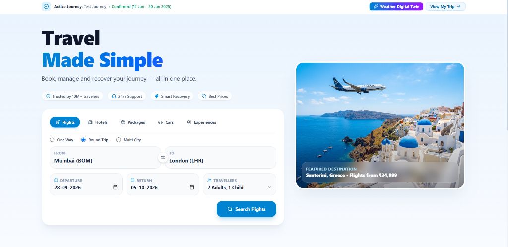

<div align="center">



# ✈️ Travora (SkyWay)
### Autonomous Travel Disruption Engine · Weather Digital Twin · Interactive Recovery

**Travora is an end-to-end, AI-powered travel resiliency and recovery platform. It models entire travel itineraries as Digital Twin Dependency Graphs, continuously monitors weather telemetry along flight corridors, predicts cascading disruptions before they occur, and enables instant 1-click or multi-channel (WhatsApp/SMS) recovery.**

[](https://travora.vercel.app)
[](https://github.com/Harsh2059/Travora)
[](LICENSE)

</div>

---

## 📋 Table of Contents

1. [Why Travora? (Executive Summary)](#-why-travora-executive-summary)
2. [The Core Problem vs. Travora's Solution](#-the-core-problem-vs-travoras-solution)
3. [The 5 Pillars of Innovation](#-the-5-pillars-of-innovation)
4. [System Architecture](#-system-architecture)
5. [Ecosystem & Directory Layout](#-ecosystem--directory-layout)
6. [Technology Stack](#-technology-stack)
7. [Step-by-Step Getting Started](#-step-by-step-getting-started)
8. [Interactive Demo Walkthrough](#-interactive-demo-walkthrough)
9. [API Reference](#-api-reference)
10. [Team & Contributors](#-team--contributors)
11. [Documentation & Deep Dives](#-documentation--deep-dives)

---

## 💡 Why Travora? (Executive Summary)

Modern travel relies on a chain of independent reservations — flight connections, airport transfers, hotel check-in windows, and business meetings. **When one flight is delayed by weather, the entire domino line of bookings falls apart.** 

Travora replaces manual phone calls and multi-app stress with an **Autonomous Resilience Engine**:
- **Before disruption**: It simulates weather stress scenarios on flight corridors using a **Weather Digital Twin**.
- **During disruption**: It maps the trip onto a **Directed Acyclic Graph (DAG)** to quantify downstream impact.
- **After disruption**: It automatically finds, ranks, and packages 3 optimal recovery plans (*Best Overall*, *Lowest Cost*, *Fastest Arrival*) and dispatches them via Web, Mobile, WhatsApp, or SMS.
- **Instant Rebooking**: Travelers can accept a recovery option with **1 click on web/mobile** or by replying `1`, `2`, or `3` directly in **WhatsApp or SMS**.

---

## 🚨 The Core Problem vs. Travora's Solution

### The Current Travel Nightmare
- **Fragmented Systems**: Airlines, hotels, and ground transport operate in complete silos with no shared awareness of a traveler's full journey.
- **Cascading Collapses**: A 3-hour flight delay causes missed ground transfers, expired hotel check-in windows, and missed keynotes.
- **Scrambling Under Stress**: Business travelers waste an average of **2.5 hours per disruption** frantically searching across multiple apps or waiting on hold.

### The Travora Experience

| Disruption Event | Legacy Travel Apps | Travora Autonomous Recovery |
|---|---|---|
| **Flight Delayed 4 Hours** | Manual calls to airline, hotel & car rental | Graph propagation auto-detects missed check-in & reschedules downstream items |
| **Severe Monsoon / Fog** | Wait until stranded at gate | **Weather Digital Twin** predicts 96% disruption risk & proactively alerts traveler |
| **Hotel Overbooked** | Scramble on 3 booking sites | Proactively ranks 3 nearby alternative hotels matching traveler preferences |
| **No Smartphone Data / Wi-Fi** | Stranded without access | **WhatsApp & SMS Gateway** sends text options; traveler replies `1` to confirm rebooking & get PNR |

---

## ✨ The 5 Pillars of Innovation

### 🧠 1. Digital Twin Dependency Graph (DAG)
Every itinerary is represented as a directed network in NetworkX where:
- **Nodes** = Bookings (Flights, Hotels, Transfers, Meetings).
- **Edges** = Temporal dependencies (e.g. *Transfer B must start at least 45 mins after Flight A lands*).
- **Impact Propagation**: When a node is delayed, BFS/DFS algorithms propagate the time shift downstream to identify broken connection windows and highlight breached vs. protected nodes.

### 🌦️ 2. Weather Digital Twin & What-If Simulator
- **Live Telemetry**: Ingests real-time weather observation metrics (temperature, rainfall mm, wind speed km/h, visibility km) along flight corridors (e.g., Mumbai BOM → Jaipur JAI corridor).
- **What-If Simulation Sliders**: Allows travelers/admins to slide weather conditions or pick presets (*Clear Skies*, *Moderate Monsoon*, *Severe Storm Benchmark*, *Cyclone Stress Test*) to preview disruption risk before taking off.
- **Predictive ML Gauges**: Calculates Disruption Risk %, Estimated Delay, Transport Impact, Hotel Impact, and AI Confidence Scores.

### ⚡ 3. Autonomous Multi-Channel Disruption Recovery Engine
When a disruption breaches an itinerary, Travora queries alternative flights, hotels, and transport services to generate 3 Pareto-ranked recovery packages:
1. 🏆 **Best for You**: Balanced optimization of cost, arrival time, and convenience.
2. 💰 **Lowest Cost**: Minimizes out-of-pocket rebooking expenses.
3. ⚡ **Fastest Arrival**: Prioritizes earliest arrival time to safeguard critical business meetings.

### 💬 4. 2-Way Interactive WhatsApp & SMS Conversational Bot
- **Zero-App Recovery**: Travelers do not even need to open an app to recover their trip.
- **Interactive WhatsApp & SMS Bot**: Inbound webhooks monitor traveler responses (`1`, `2`, `3`). Upon receiving a reply, Travora atomically executes the selected recovery plan, generates a new PNR, and broadcasts confirmation back immediately.

### 📡 5. On-Premise Hardware SMS Gateway
- **Zero Third-Party Dependency**: Includes a standalone Android Flutter app that turns any spare Android smartphone into a hardware SMS gateway.
- **Direct SIM Dispatch**: Uses native Android `SmsManager` to dispatch real SMS messages directly via carrier SIM cards, eliminating expensive SMS API subscriptions.

---

## 🏗️ System Architecture

```
┌─────────────────────────────────────────────────────────────────────────────────────────┐
│                                    TRAVORA PLATFORM                                     │
├─────────────────────────────────────────────────────────────────────────────────────────┤
│                                                                                         │
│   ┌─────────────────────────┐     REST API      ┌──────────────────────────────────┐   │
│   │   React Web Dashboard   │◄─────────────────►│         FastAPI Backend          │   │
│   │   (Vite + Tailwind)     │                   │          (Python 3.10+)          │   │
│   └─────────────────────────┘                   │                                  │   │
│   ┌─────────────────────────┐     REST API      │  ┌────────────────────────────┐  │   │
│   │   Flutter Mobile App    │◄─────────────────►│  │ Digital Twin Graph Engine  │  │   │
│   │   (iOS & Android)       │                   │  │ (NetworkX DAG Model)       │  │   │
│   └─────────────────────────┘                   │  └─────────────┬──────────────┘  │   │
│                                                 │                │                 │   │
│   ┌─────────────────────────┐    Job Polling    │  ┌─────────────▼──────────────┐  │   │
│   │   Android SMS Gateway   │◄─────────────────►│  │ Weather Digital Twin       │  │   │
│   │   (Native SIM Hardware) │                   │  │ (Telemetry & Simulator)    │  │   │
│   └────────────┬────────────┘                   │  └─────────────┬──────────────┘  │   │
│                │ Physical SIM                   │                │                 │   │
│                v                                │  ┌─────────────▼──────────────┐  │   │
│   ┌─────────────────────────┐                   │  │ Multi-Channel Recovery     │  │   │
│   │ Traveler SMS (Text 1/2) │                   │  │ (3 Ranked Pareto Plans)    │  │   │
│   └─────────────────────────┘                   │  └─────────────┬──────────────┘  │   │
│                                                 │                │                 │   │
│   ┌─────────────────────────┐    Meta Webhook   │  ┌─────────────▼──────────────┐  │   │
│   │  WhatsApp Interactive   │◄─────────────────►│  │ WhatsApp & SMS Bot Engine  │  │   │
│   │  (2-Way Bot Messaging)  │                   │  └─────────────┬──────────────┘  │   │
│   └─────────────────────────┘                   │                │                 │   │
│                                                 │  ┌─────────────▼──────────────┐  │   │
│                                                 │  │ SQLite / PostgreSQL DB     │  │   │
│                                                 │  │ (SQLAlchemy ORM)           │  │   │
│                                                 │  └────────────────────────────┘  │   │
│                                                 └──────────────────────────────────┘   │
└─────────────────────────────────────────────────────────────────────────────────────────┘
```

---

## 📁 Ecosystem & Directory Layout

The repository is structured into modular micro-services and applications:

```
Travora/
├── backend/            # Python FastAPI Backend
│   ├── main.py         # Application entrypoint & REST API routes
│   ├── models.py       # SQLAlchemy ORM schemas (Trips, Bookings, Disruptions, Executions)
│   ├── seed.py         # Database initializer & sample journey seeder
│   └── services/       # Core engines (Graph, Impact, Recovery, ML, Weather, WhatsApp, SMS)
│
├── frontend/           # React 19 + TypeScript Web App
│   ├── src/screens/    # Dashboard, Timeline, Digital Twin Weather, Admin Console
│   └── src/components/ # Leaflet Route Map, Recovery Plan Cards, Simulator Modals
│
├── mobile/             # Flutter Mobile Application (iOS & Android)
│   └── lib/screens/    # Home Dashboard, Journey Timeline, 1-Tap Recovery, Profile
│
├── sms_gateway/        # Standalone Android Flutter Hardware SMS Gateway
│   └── lib/            # Direct SIM SMS dispatcher via Android SmsManager MethodChannel
│
└── docs/               # Architecture design docs & screenshot references
```

---

## 🛠️ Technology Stack

| Ecosystem Layer | Core Technologies |
|---|---|
| **Backend Engine** | Python 3.10+, FastAPI, SQLAlchemy, NetworkX, scikit-learn, Uvicorn, Pydantic |
| **Web Frontend** | React 19, TypeScript, Vite, Tailwind CSS, Leaflet Maps, Lucide Icons, Axios |
| **Mobile App** | Flutter 3.x, Dart, GoRouter, Riverpod, Secure Storage |
| **Hardware SMS Gateway** | Flutter Android, Kotlin `SmsManager` MethodChannel |
| **Integrations** | Meta WhatsApp Cloud API, OpenWeather Telemetry API |

---

## 🚀 Step-by-Step Getting Started

### Prerequisites
- **Node.js** v18+ & **npm**
- **Python** 3.10+
- **Flutter SDK** `>=3.0.0` *(optional, for Mobile & SMS Gateway)*

---

### 1. Launch the Backend Service

```bash
cd backend

# Create & activate Python virtual environment
python -m venv venv
venv\Scripts\activate        # Windows (PowerShell)
# source venv/bin/activate   # macOS / Linux

# Install dependencies
pip install -r requirements.txt

# Seed local database with demo trip journeys
python seed.py

# Start FastAPI server
uvicorn main:app --reload --host 0.0.0.0 --port 8000
```
- **Backend API**: `http://localhost:8000`
- **Interactive API Docs (Swagger UI)**: `http://localhost:8000/docs`

---

### 2. Launch the Web Frontend

In a new terminal window:

```bash
cd frontend

# Install dependencies
npm install

# Start Vite development server
npm run dev
```
- **Web App**: `http://localhost:5173`

---

### 3. Launch the Mobile Application (Optional)

In a new terminal window:

```bash
cd mobile
flutter pub get
flutter run
```

---

### 4. Launch the Android Hardware SMS Gateway (Optional)

If using an Android device as a hardware SMS gateway:

```bash
cd sms_gateway
flutter pub get
flutter run
```

---

## 🎬 Interactive Demo Walkthrough

1. **Explore the Digital Twin Weather Dashboard**:
   - Open `http://localhost:5173/trip/1/digital-twin`
   - Adjust the **What-If Weather Simulator** sliders (Rainfall, Wind Speed, Visibility) or click **Cyclone Stress Test** to observe live disruption risk calculations and map corridor highlights.
2. **Simulate an Itinerary Disruption**:
   - Open the **Admin Console** or **Traveler Dashboard**.
   - Select a trip and trigger a disruption (e.g. *Flight Cancelled* or *Severe Storm Delay*).
3. **Review Cascading Impact**:
   - Navigate to **View Impact** to see how downstream transfers and hotel check-in windows are flagged as breached.
4. **Select & Execute Recovery Plan**:
   - Click **Find Recovery Options** to open the 3 ranked Pareto recovery plan cards.
   - Choose a plan (*Best for You*, *Lowest Cost*, or *Fastest Arrival*) and click **Execute Recovery**.
5. **Interactive WhatsApp & SMS Demo**:
   - When a disruption is triggered, Travora dispatches an SMS or WhatsApp alert with option choices:
     > `1️⃣ Alternative Flight SpiceJet 10:20 AM`
     > `2️⃣ Alternative Flight IndiGo 12:10 PM`
     > `Reply with 1, 2, or 3 to rebook.`
   - Replying `1` automatically confirms the rebooking, generates a new PNR, and updates the traveler's digital timeline!

---

## 📡 Key API Endpoints Reference

| Method | Endpoint | Purpose |
|---|---|---|
| `GET` | `/api/health` | Service health status check |
| `GET` | `/api/trips` | Retrieve list of traveler trips |
| `GET` | `/api/trips/{id}/graph` | Fetch NetworkX DAG structure and temporal edges |
| `GET` | `/api/trips/{id}/digital-twin` | Retrieve Weather Digital Twin telemetry and disruption risk % |
| `POST` | `/api/trips/{id}/simulate` | Inject a disruption event (flight delay, hotel cancel) |
| `GET` | `/api/trips/{id}/impact` | Get cascading impact assessment breakdown |
| `GET` | `/api/trips/{id}/recovery-plans` | Generate 3 ranked Pareto recovery plans |
| `POST` | `/api/trips/{id}/execute` | Execute selected recovery plan |
| `POST` | `/api/whatsapp/webhook` | Webhook for Meta WhatsApp inbound interactive replies |
| `GET` | `/api/sms-gateway/jobs` | Pending SMS job queue for Android SMS Gateway |

---

## 👥 Team & Contributors

Travora (SkyWay) was conceptualized and built by:

| Team Member | Role / Focus | GitHub Profile |
|---|---|---|
| **Harsh Raut** | Core Engine & Platform Architecture | [@Harsh2059](https://github.com/Harsh2059) |
| **Shubham Shah** | Platform Development & Systems Engineering | [@Shubham55-hash](https://github.com/Shubham55-hash) |
| **Dhruv Soni** | Mobile & Multi-Channel Engineering | [@17DhruvSoni](https://github.com/17DhruvSoni) |
| **Aditya Pathak** | Data Models & Intelligent Recovery | [@Aditya-Pathak-1](https://github.com/Aditya-Pathak-1) |

---

## 📄 Documentation & Deep Dives

For further architectural and design details, explore the [`docs/`](file:///c:/Projects/Travora/Travora/docs) directory:
- [ARCHITECTURE.md](file:///c:/Projects/Travora/Travora/docs/ARCHITECTURE.md) — System architecture & data flow
- [TECHNICAL_DECISIONS.md](file:///c:/Projects/Travora/Travora/docs/TECHNICAL_DECISIONS.md) — Architectural trade-offs & design choices
- [DEMO_SCRIPT.md](file:///c:/Projects/Travora/Travora/docs/DEMO_SCRIPT.md) — Guided step-by-step presentation script
- [FEATURE_TRACEABILITY.md](file:///c:/Projects/Travora/Travora/docs/FEATURE_TRACEABILITY.md) — Requirement mapping matrix

---

<div align="center">

**Travora (SkyWay)** — *Because your itinerary should be smarter than your disruption.*

</div>

