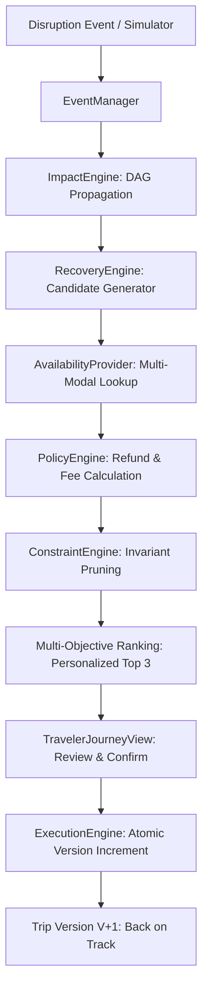

# System Architecture — Travel Recovery Engine (Travora)

## 1. High-Level Architectural Overview

The **Travel Recovery Engine** is a deterministic, constraint-aware travel resilience platform designed to model, detect, evaluate, and resolve complex disruptions across whole multi-modal journeys.

```
+-----------------------------------------------------------------------------------+
|                               TRAVELER / CLIENT UX                                |
|  - 6-Step Traveler Assistant Flow (TravelerJourneyView)                           |
|  - Progressive Disclosure Technical Drawer (TechnicalDetailsDrawer)              |
|  - Version Tree & Before-After Itinerary Diff (VersionComparisonModal)             |
+------------------------------------------+----------------------------------------+
                                           | HTTP / REST (FastAPI)
                                           v
+-----------------------------------------------------------------------------------+
|                              BACKEND PIPELINE (FASTAPI)                            |
|                                                                                   |
|  1. Event Ingestion & Simulator         2. Digital Twin & Impact Propagation      |
|     - EventManager & DisruptionRecord       - NetworkX Directed Acyclic Graph     |
|     - Multi-modal event normalizer          - Dynamic buffer & connection test    |
|                                                                                   |
|  3. Multi-Modal Availability Provider   4. Policy & Financial Engine              |
|     - Abstract AvailabilityProvider         - Airline, Hotel & Rail refund rules  |
|     - Flights, Trains, Cabs, Hotels         - Change fees & non-refundable funds  |
|                                                                                   |
|  5. Constraint Satisfaction Engine      6. Multi-Objective Optimization           |
|     - Invariant pruning (Conference)        - Weighted scoring (Time, Cost, etc.) |
|     - Infeasible plan rejection             - Traveler personalized ranking       |
|                                                                                   |
|  7. Execution Engine & State Machine    8. Versioning & Audit Engine              |
|     - Transaction rollback & idempotency    - Immutable snapshot history          |
|     - Mock booking vouchers & PNRs          - Semantic version increments         |
+-----------------------------------------------------------------------------------+
```

---

## 2. Core Subsystems

### 2.1 Dependency Graph & Digital Twin (`services/graph/`)
- **Engine**: NetworkX `DiGraph`.
- **Nodes**: Flights, Trains, Transfers, Hotels, Events.
- **Edges**: Inferred dynamically based on geographic endpoints, temporal order, and connection buffer requirements (minimum 60 minutes for flight connections, 45 minutes for rail-to-transfer).
- **Validation**: Enforces Directed Acyclic Graph (DAG) properties, rejecting cycles or self-loops.

### 2.2 Impact Propagation Engine (`services/impact/`)
- Traverses downstream nodes in topological order.
- Calculates buffer degradation ($\Delta t$). If connection buffer falls below minimum, flags connection as `AT_RISK` or `MISSED`.
- Identifies critical commitment exposure (e.g. keynote conference attendance).

### 2.3 Multi-Modal Availability Provider (`services/availability/`)
- Abstract interface `AvailabilityProvider` providing:
  - `find_alternate_flights(origin, destination, after_time)`
  - `find_alternate_trains(origin, destination, after_time)`
  - `find_alternate_transfers(pickup, dropoff, pickup_time)`
  - `find_alternate_hotels(location, check_in, check_out)`
  - `find_alternate_activities(location, target_date)`
- Extensible to live GDS / Amadeus / Sabre / IRCTC APIs.

### 2.4 Policy & Financial Engine (`services/policy/`)
- Deterministic calculation of refunds, change penalties, and cancellation fees based on carrier rules and booking fare class (`FLEXIBLE`, `STRICT`, `NON_REFUNDABLE`).
- Calculates true out-of-pocket `net_cost = additional_cost - refund_received + change_fees + cancellation_fees`.

### 2.5 Constraint Satisfaction & Optimization (`services/constraints/`, `services/recovery/`)
- Prunes all candidate plans that violate hard invariants (e.g. missing fixed-priority conference).
- Scores feasible plans across multi-objective Pareto dimensions:
  $$Score = w_{time} \cdot S_{time} + w_{cost} \cdot S_{cost} + w_{comfort} \cdot S_{comfort} + w_{direct} \cdot S_{direct}$$
- Ranks top choices into clear traveler categories: ⭐ Best for You, 💰 Cheapest, ⚡ Fastest Upgrade.

### 2.6 Execution Engine & State Machine (`services/execution/`, `services/versioning/`)
- Manages strict lifecycle transitions: `DRAFT` $\rightarrow$ `APPROVED` $\rightarrow$ `EXECUTED` (or `ROLLED_BACK`).
- Stale plan protection: rejects execution if the itinerary version has progressed.
- Transactional atomic update: clones existing itinerary, mutates items, and stamps new version $V+1$.

---

## 3. Data Flow Diagram


